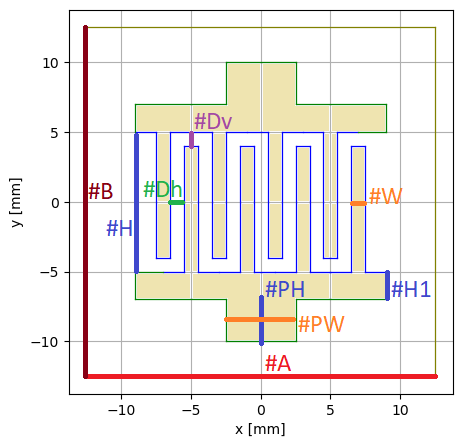

# What it is?

Repository provides function of mask dxf and prev-png generator

## how to configure?
<table>
<tr>
<th> Code </th>
<th> Image </th>
</tr>
<tr>
<td>

```py
mask_details ={
    'mask_height': 25,  #A  width of entire mask body
    'mask_width': 25,   #B  height of entire mask body 
    'spike_width': 1.0, #W  width of one spike of mask
    'spike_height': 10, #H  height of one spike of mask
    'spike_sep_h': 1.0, #Dh distance between spikes
    'spike_sep_v': 1.0, #Dv distance between spike head and mask body
    'spike_count': 4,   #N  count of spikes on one side 
    'spike_support': 2, #H  height of collector electrode
    'pad_width': 5,     #PW width of pad
    'pad_height': 3     #PH height of pad
}
```
</td>
<td>



</td>
</tr>
</table>

## how to use?
```py
# import the only one module You need
from dxf_mask_generator_V1S0R0 import give_me_mask

# define geometry variables, think in milimeters
mask_details ={
    'mask_height': 25,
    'mask_width': 25,
    'spike_width': 1.0,
    'spike_height': 10,
    'spike_sep_h': 1.0,
    'spike_sep_v': 1.0,
    'spike_count': 4,
    'spike_support': 2,
    'pad_width': 5,
    'pad_height': 3
}

# ask whatever you wish, and it shall be done for you (J 15:7)
give_me_mask(config=mask_details, filename='test')
```

# dependencies
```py
pip install ezdxf[draw]
```

